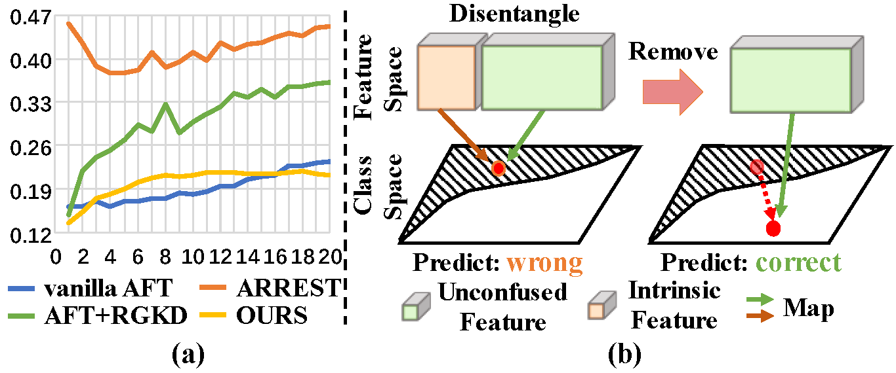
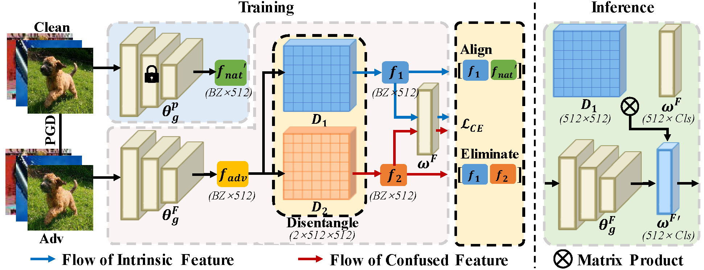
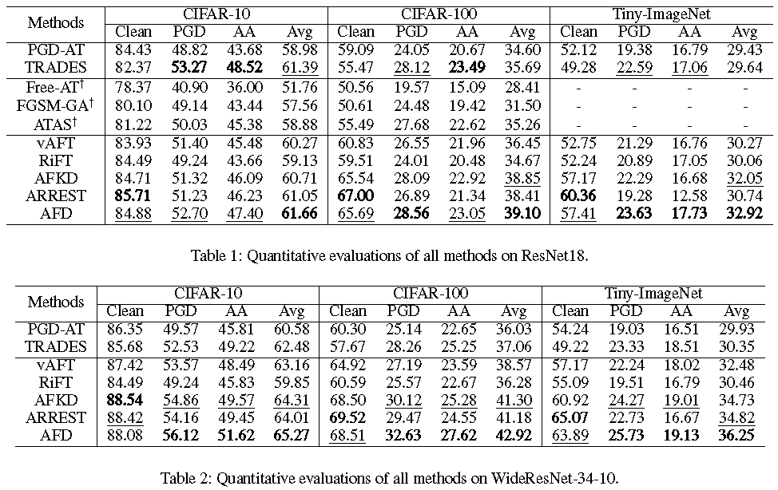

<div align="center">

<h1>AFD: Mitigating Feature Gap for Adversarial  Robustness by Feature Disentanglement</h1>

<div>
    <a href='https://scholar.google.com/citations?user=wxC_XDMAAAAJ' target='_blank'>Nuoyan Zhou</a><sup>1</sup>&emsp;
    <a target='_blank'>Dawei Zhou</a><sup>1</sup>&emsp;
    <a href='https://scholar.google.com/citations?user=5fHHi24AAAAJ' target='_blank'>Decheng Liu</a><sup>1</sup>&emsp;
    <a href='https://scholar.google.com/citations?user=SRBn7oUAAAAJ' target='_blank'>Nannan Wang</a><sup>1</sup>&emsp;
          <a href='https://scholar.google.com/citations?user=VZVTOOIAAAAJ' target='_blank'>Xinbo Gao</a><sup>2</sup>
</div>
<div>
    <sup>1</sup>State Key Laboratory of Integrated Services Networks, Xidian University, China&emsp;<br>
    <sup>2</sup>Chongqing Key Laboratory of Image Cognition, Chongqing University of Posts and Telecommunications, China;<br>
</div>
<div>
</div>
<div>
    <strong>AAAI 2025</strong>
</div>

<div>
    <h4 align="center">
        <a href="https://arxiv.org/abs/2401.14707" target='_blank'>
        
        </a>
        <a href="https://huggingface.co/nuoyanzhou/AFD/tree/main" target='_blank'>
        
        </a>
        <a target='_blank'>
        
    </h4>
</div>

⭐ If AFD is helpful to your projects, please help star this repo. Thanks! 🤗


</div>

<be>


## 🔥 News
- **2024.12.10**: This repo is created.
- **2024.12.11**: Pretrained and finetuned models are released.

## :bulb: Motivation
**This paper uncovers a surprising increasing trend in the gap of features between natural and adversarial samples in AFT methods**, **and further investigates it from the perspective of features**. We suppose some specific latent features (confused features) leads to the feature gap. 
<div align=center>

</div>


## 📸 Pipeline
We propose Adversarial Fine-tuning via Disentanglement (AFD) to bridge the feature gap to enhance robustness, with the disentanglement and alignment to eliminate the confused features. 
<div align=center>

</div>


## :trophy: Results
**Bold** and <u>Underline</u> mean the first and second best result.
<div align=center>

</div>


## 🔧 Dependencies and Installation

1. Clone this repo and navigate to DreamClear folder

   ```bash
   git clone https://github.com/changzhang777/AFD.git
   cd AFD
   ```

2. Create Conda Environment and Install Package

   ```bash
   conda create -n AFD python=3.9 -y
   conda activate AFD
   pip install torch==2.1.0 torchvision==0.16.0 torchaudio==2.1.0 --index-url https://download.pytorch.org/whl/cu118
   pip install -r requirement.txt
   ```
3. Download Pre-trained Models (All models can be downloaded at [Huggingface](https://huggingface.co/nuoyanzhou/AFD/tree/main/baseline) for convenience, their training and test log are also availiable.)
      #### Naturally pretrained Model:
      * `ResNet18-CIFAR10`: [model-100.pth](https://huggingface.co/nuoyanzhou/AFD/tree/main/baseline/ResNet18-Standard-CIFAR10/model-100.pth)
      * `ResNet18-CIFAR100`: [model-100.pth](https://huggingface.co/nuoyanzhou/AFD/tree/main/baseline/ResNet18-Standard-CIFAR100/model-100.pth)
      * `ResNet18-Tiny-ImageNet`: [model-100.pth](https://huggingface.co/nuoyanzhou/AFD/tree/main/baseline/ResNet18-Standard-Tiny-ImageNet/model-100.pth)
      * `ResNet18-ImageNet`: [model-100.pth](https://huggingface.co/nuoyanzhou/AFD/tree/main/baseline/ResNet18-Standard-ImageNet/model-100.pth)
      * `ResNet50-CIFAR10`: [model-100.pth](https://huggingface.co/nuoyanzhou/AFD/tree/main/baseline/ResNet50-Standard-CIFAR10/model-100.pth)
      * `ResNet50-CIFAR100`: [model-100.pth](https://huggingface.co/nuoyanzhou/AFD/tree/main/baseline/ResNet50-Standard-CIFAR100/model-100.pth)
      * `WideResNet34-10-CIFAR10`: [model-100.pth](https://huggingface.co/nuoyanzhou/AFD/tree/main/baseline/WideResNet34-Standard-CIFAR10/model-100.pth)
      * `WideResNet34-10-CIFAR100`: [model-100.pth](https://huggingface.co/nuoyanzhou/AFD/tree/main/baseline/WideResNet34-Standard-CIFAR100/model-100.pth)
      * `WideResNet34-10-Tiny-ImageNet`: [model-100.pth](https://huggingface.co/nuoyanzhou/AFD/tree/main/baseline/WideResNet34-Standard-Tiny-ImageNet/model-100.pth)
      #### Other provided Model:
      * `PGD-AT Trained`
      * `TRADES Trained`
      * `MART Trained`
   
    |    |  PGD-AT Trained   | TRADES Trained | MART Trained |
    | ----  | ----  | ----  | ----  |
    | ResNet18-CIFAR10   | [model-120.pth](https://huggingface.co/nuoyanzhou/AFD/tree/main/baseline/ResNet18-PGD-AT-CIFAR10-seed-0/model-120.pth)  | [model-120.pth](https://huggingface.co/nuoyanzhou/AFD/tree/main/baseline/ResNet18-TRADES-CIFAR10-seed-0/model-120.pth)  | [model-120.pth](https://huggingface.co/nuoyanzhou/AFD/tree/main/baseline/ResNet18-MART-CIFAR10-seed-0/model-120.pth) |
    | ResNet18-CIFAR100  | [model-120.pth](https://huggingface.co/nuoyanzhou/AFD/tree/main/baseline/ResNet18-PGD-AT-CIFAR100-seed-0/model-120.pth) | \  |  \ |
    | ResNet18-Tiny-ImageNet  | [model-120.pth](https://huggingface.co/nuoyanzhou/AFD/tree/main/baseline/ResNet18-PGD-AT-Tiny-ImageNet-seed-0/model-120.pth) | [model-120.pth](https://huggingface.co/nuoyanzhou/AFD/tree/main/baseline/ResNet18-TRADES-Tiny-ImageNet-seed-0/model-120.pth)  | \  |
    | WideResNet28-10-CIFAR10   | [model-120.pth](https://huggingface.co/nuoyanzhou/AFD/tree/main/baseline/WideResNet28-PGD-AT-CIFAR10-seed-0/model-120.pth)  | [model-120.pth](https://huggingface.co/nuoyanzhou/AFD/tree/main/baseline/WideResNet28-TRADES-CIFAR10-seed-0/model-120.pth)  | [model-120.pth](https://huggingface.co/nuoyanzhou/AFD/tree/main/baseline/WideResNet28-MART-CIFAR10-seed-0/model-120.pth)   |
    | WideResNet34-10-CIFAR10   | [model-120.pth](https://huggingface.co/nuoyanzhou/AFD/tree/main/baseline/WideResNet34-PGD-AT-CIFAR10-seed-0/model-120.pth)  | [model-120.pth](https://huggingface.co/nuoyanzhou/AFD/tree/main/baseline/WideResNet34-TRADES-CIFAR10-seed-0/model-120.pth)  | \  |
    | WideResNet34-10-CIFAR100  | [model-120.pth](https://huggingface.co/nuoyanzhou/AFD/tree/main/baseline/WideResNet34-PGD-AT-CIFAR100-seed-0/model-120.pth) | [model-120.pth](https://huggingface.co/nuoyanzhou/AFD/tree/main/baseline/WideResNet34-TRADES-CIFAR100-seed-0/model-120.pth)  | \ |
    | WideResNet34-10-Tiny-ImageNet  | [model-120.pth](https://huggingface.co/nuoyanzhou/AFD/tree/main/baseline/WideResNet34-PGD-AT-Tiny-ImageNet-seed-0/model-120.pth) |  [model-120.pth](https://huggingface.co/nuoyanzhou/AFD/tree/main/baseline/WideResNet34-TRADES-Tiny-ImageNet-seed-0/model-120.pth)  | \  |

      
## 🎰 Train
#### I - Prepare training data
*  CIFAR10
*  CIFAR100
*  Tiny-ImageNet

#### II - Training for AFD
Run the following command to train ADF with default settings:
```shell
python3 tl+sl.py \
--alpha 0.05 # the weight to obtain confused features \
--beta 0.25 # the weight to keep intrinsic features distinct from confused features \
--gamma 25 # the weight to align with features of naturally pretrained models \
--pretrained /path/to/pretrained_model \
--model-dir /path/to/save_finetuned_model \
```
Please modify the path of training datasets in `ADF/tl+sl.py`. You can also modify the training hyper-parameters (e.g., `lr`, `batch_size`, `weight_decay`) in this file, according to your own GPU machines.

## ⚡ Inference
Run the following command to evaluate the models on [AutoAttack](https://github.com/fra31/auto-attack) or [Adaptive AutoAttack](https://github.com/liuye6666/adaptive_auto_attack). Our finetuned models have been released in [Huggingface](https://huggingface.co/nuoyanzhou/AFD/tree/main/ours). We suggest that the user begins from the latter since the latter is faster than the former by several times with a similar robust accuracy.
```shell
python3 test_AA.py # AutoAttack
python3 Adaptive_Auto_Attack_main.py # Adaptive AutoAttack
```

## 🪪 License

The provided code and pre-trained weights are licensed under the [Apache 2.0 license](LICENSE).

## 🤗 Acknowledgement

This code is based on [ANCRA](https://github.com/changzhang777/ANCRA). 

## 📧 Contact
If you have any questions, please feel free to reach me out at nuoyanzhou@stu.xidian.edu.cn. 

## 📖 Citation
If you find our work useful for your research, please consider citing our paper:
```
@article{zhou2024mitigating,
  title={Mitigating Feature Gap for Adversarial Robustness by Feature Disentanglement},
  author={Zhou, Nuoyan and Zhou, Dawei and Liu, Decheng and Gao, Xinbo and Wang, Nannan},
  journal={arXiv preprint arXiv:2401.14707},
  year={2024}
}
```
